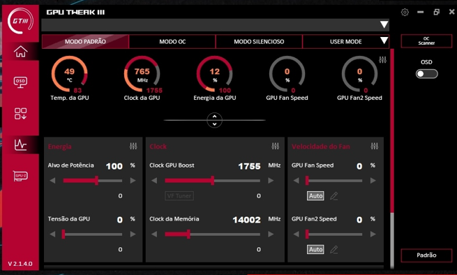
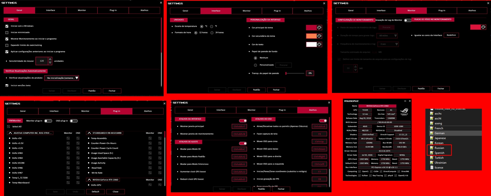

# 🎮 ASUS GPU Tweak III — Tradução para Português do Brasil (PT-BR) 🇧🇷

-green?style=for-the-badge)

Tradução PT-BR do **ASUS GPU Tweak III**, atualizada a partir do arquivo de localização mantido por **Emerson Teles**. O pacote inclui instalação por script, restauração do arquivo inglês e instalação manual.

## 📸 Destaque da tradução

  

<em>Interface principal em PT-BR. Esta captura foi feita no GPU Tweak III v2.1.4.0.</em>

### Mais telas traduzidas

  

---

## 📋 Índice

1. [Sobre a tradução](#-sobre-a-tradução)
2. [Versão compatível do programa](#-versão-compatível-do-programa)
3. [Download](#-download)
4. [Instalação pelo script](#-instalação-pelo-script)
5. [Instalação manual](#-instalação-manual)
6. [Restaurar o arquivo original](#-restaurar-o-arquivo-original)
7. [Por que o arquivo se chama asengxml](#-por-que-o-arquivo-se-chama-asengxml)
8. [Créditos](#-créditos)

---

## 🌟 Sobre a tradução

O pacote usa o arquivo inglês presente na instalação do GPU Tweak III 2.1.9.5 como estrutura de referência e aplica nele as traduções de `aseng-pt-br.xml` mantidas por Emerson Teles. Foram traduzidas também as nove chaves novas, incluindo os avisos e opções de desligamento automático por sobrecorrente. As chaves antigas que não existem mais no arquivo inglês atual não são carregadas na versão final.

O arquivo de idioma se chama `aseng.xml` para que o programa o carregue. O conteúdo está em português brasileiro, mas o nome técnico original precisa ser preservado.

## 🧩 Versão compatível do programa

Esta atualização foi preparada usando o arquivo de idioma da versão estável **2.1.9.5**, publicada pela ASUS em 18/09/2026. Baixe o programa somente pela [página oficial de suporte da ASUS](https://www.asus.com/supportonly/gpu%20tweak%20iii/helpdesk_download/).

O pacote não inclui o instalador do GPU Tweak III. A tradução continua válida para os textos e IDs já incluídos. Uma atualização do aplicativo pode reinstalar o arquivo inglês; basta executar o script novamente. A ASUS também pode adicionar novas chaves em versões futuras: isso não altera as chaves traduzidas existentes, mas textos novos podem aparecer em inglês até serem incluídos numa revisão da tradução.

## 📦 Download

Baixe `GPU-Tweak-III-Traducao-PTBR-v1.0.0.zip` na seção [Releases](https://github.com/Emertels/GPU-Tweak-III-Traducao-PTBR/releases/latest). O ZIP inclui `aseng.xml`, o script de instalação/restauração e este guia rápido.

## 🚀 Instalação pelo script

1. Extraia o ZIP para uma pasta de sua preferência.
2. Dê dois cliques em `Iniciar-Traducao.bat`.
3. Autorize a solicitação do Windows para executar com privilégios de administrador.
4. No menu, escolha **Aplicar tradução PT-BR**.
5. Se o programa não estiver na pasta padrão, selecione a pasta de instalação que contém `aseng.xml`.
6. Feche e abra novamente o GPU Tweak III.

O script pode ficar em qualquer pasta ou unidade do computador: ele carrega o `aseng.xml` que fica ao lado dele e procura o GPU Tweak III no caminho padrão. Se a instalação estiver em outro lugar, permite selecionar a pasta do jogo. O menu exibe a data e o horário de início da sessão e oferece **Instalar tradução PT-BR** e **Restaurar inglês do backup**.

Na primeira instalação, o script salva o arquivo inglês da instalação como `_aseng.xml` na própria pasta do jogo. Se uma atualização da ASUS colocar um `aseng.xml` inglês novo, ao instalar novamente o script atualiza o backup para preservar essa versão. A restauração copia `_aseng.xml` de volta para `aseng.xml`.

## 🛠️ Instalação manual

1. Feche o GPU Tweak III.
2. Abra a pasta de instalação, normalmente `C:\Program Files (x86)\ASUS\GPUTweakIII`.
3. Se ainda não existir, faça uma cópia do arquivo original `aseng.xml` e renomeie a cópia para `_aseng.xml` na mesma pasta.
4. Copie o `aseng.xml` deste pacote para a pasta do programa e confirme a substituição.
5. Abra novamente o GPU Tweak III.

## 🔄 Restaurar o arquivo original

Execute `Iniciar-Traducao.bat`, escolha **Restaurar arquivo inglês do backup** e confirme a pasta do programa, se solicitado. O script copia `_aseng.xml` de volta para `aseng.xml`.

O backup é mantido na pasta do jogo. Não o apague se quiser poder restaurar o idioma original.

## 🏷️ Por que o arquivo se chama `aseng.xml`

O GPU Tweak III procura o idioma inglês pelo identificador/nome `aseng.xml`. Renomear o arquivo para `pt-br.xml`, `português.xml` ou outro nome não registra um novo idioma: o programa simplesmente não carrega a tradução. Por isso, o pacote substitui o `aseng.xml` em uso e conserva o original com o nome `_aseng.xml` para restauração.

## 👤 Créditos

Tradução PT-BR e atualização: **Emerson Teles**.

O ASUS GPU Tweak III é propriedade da ASUS. Este projeto comunitário não é oficial nem afiliado à ASUS.
